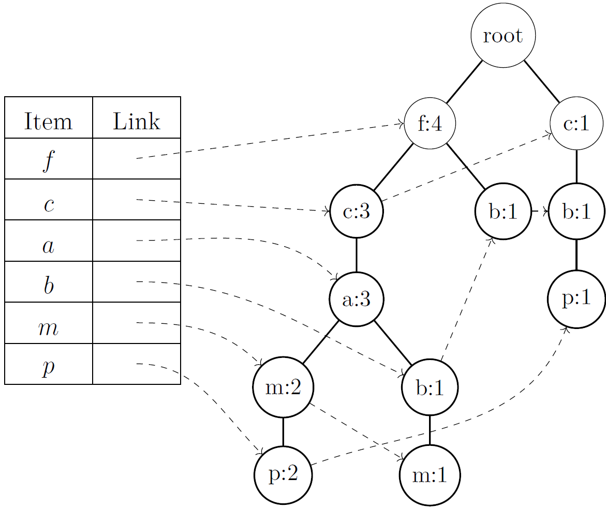

This post will introduce you to the concept of association rule mining. We will discuss the basics of association rule
mining, define key terms such as support, confidence and mine association rules using Kaggle's Market Basket Analysis
dataset.

## What is an association?

Wikipedia gives us such definition of association:
> any relationship between two measured quantities that renders them statistically dependent (but not necessarily causal
> or a correlation)

## Definitions

> Consider the set \\(\mathcal{I}=\\{ i_1, i_2, ..., i_m \\}\\), where the elements of this set are literals, which we
> will
> also call **items**.
> Any subset \\(T\\) of the set \\({\mathcal{I}}\\) will be called **item set** or a **transaction**.

> Example: Let \\( \mathcal{I}= \\{ \textrm{milk}, \textrm{butter}, \textrm{eggs} \\} \\) and \\(T = \\{ \textrm{milk},
> \textrm{butter}\\}\\), then \((T\\) is a transaction.

> Let \\(\mathcal{I}\\) be the set of all items. The pair \\((X,Y) \\) will be called **association rule** if \\(X
> \subseteq \mathcal{I} \\), \\(Y \subseteq \mathcal{I} \\) and also \\(X
> \cap Y = \emptyset \\). We will denote it as \\(X \Rightarrow Y \\).

> Example: Let \\(\mathcal{I} = \\{ \textrm{milk}, \textrm{butter}, \textrm{eggs}\\} \\), then \\( \\{ \textrm{milk} \\}
> \Rightarrow \\{ \textrm{butter} \\} \\) is an association rule.

## Metrics

To determine if an association rule is interesting, we will use the following metrics:
> **Support**: The support of an itemset \\(X \\) is defined as the proportion of transactions in the database in which the itemset appears.

$$
\large \textrm{support}(X) = \frac{\text{number of transactions, containing } X}{\text{total number of transactions }}
$$

> **Confidence**: The confidence of a rule \\(X \Rightarrow Y \\) is the proportion of the transactions that contain \\(
>X \\) and transactions that contain \\(X \\) and \\(Y \\).

$$
\large \textrm{confidence}(X \Rightarrow Y) = \frac{\text{support}(X \cup Y)}{\text{support}(X)}
$$

## Algorithms

### [Apriori](https://en.wikipedia.org/wiki/Apriori_algorithm)

This algorithm was proposed by Agrawal and Srikanth in 1994[^1]. It got its name due to an
assumption we call the **a priori principle**. This states that:
> Every subset of a frequented set of items is also frequented. Equivalently, if a set is non-frequented, then every
superset of it is also non-frequented.

You may also encounter the term **antimonotonicity** or **downward closure**.

Thanks to this fact, one can effectively narrow down the search space. The given principle
allows to gradually increase the size of the sets, and thus find all frequented sets.

#### How does it work?

The algorithm makes several passes through the database. The first pass simply counts the _support_ values of
each item -- those that meet a threshold are considered frequent single-element sets. In the $k$-th step, based on the
frequent itemsets found in $(k-1)$-th step a using the _apriori-gen_ function, $k$-element candidate sets will be
generated. In this step, we then go through the database and compute the _support_ of the candidate sets. At the
end of the traversal, only those candidate sets that are frequent are selected, and those are used in the next step. The
algorithm is executed until all candidate sets from the previous transition have support less than a specified
threshold.

#### Pseudocode

```python
L = { frequent 1-itemsets }
for (k = 2; Lk_1 != ∅; k++) do
    Ck = apriori_gen(Lk_1)
    for all transactions t in database do
        Ct = subset(Ck, t)
        for all candidates c in Ct do
            c.count++
    Lk = { c ∈ Ck | c.count ≥ min_sup }
```

**apriori_gen** function, which takes all $(k-1)$-element frequent sets and returns all $k$-element frequent sets,
consists of two steps:
- **JOIN step:** remove all sets that have an infrequent subset.
```sql
INSERT INTO Ck
SELECT p.item1,p.item2, ... , p.itemk_1, q.itemk_1
FROM Lk_1 p, Lk_1 q
WHERE p.item1 = q.item1, ..., p.itemk_2 = q.itemk_2 , p.itemk_1 < q.itemk_1
```

- **PRUNE step:** join all sets that have the same $(k-2)$ prefix.
```python
 for all set c ∈ Ck do
     for all (k-1)_element set s, s ⊆ c do
     if s ̸∈ Lk_1 then
     remove c from Ck;
```

#### Advantages and disadvantages

The main disadvantage of this algorithm is its computational complexity. Processing a large number of candidate sets is
expensive. For example, if there are $10^4$ frequent single-element sets, Apriori needs to generate more than $10^7$
two-element sets. Furthermore, to find some frequent set of cardinality 100, such as $\{a_1, ...,a_{100}\}$, the
algorithm needs to generate more than $2^{100} \approx 10^{30}$ candidates[^2].

###  [FP-Growth](https://en.wikipedia.org/wiki/Association_rule_learning#FP-growth_algorithm)

The algorithm was proposed in 2000 by Han, Pei and Yin[^2]. It represents a significant improvement
over the previous one -- it does not require the generation of candidate sets, which leads to a substantial increase in
performance.

The FP-growth algorithm consists of two phases:

1. **construct** FP-tree, which is a compact representation of the data, is **constructed** in the first phase.
2. using FP-tree, **generate** frequent itemsets.

#### How does it work?

The algorithm represents the database using a tree structure called **frequent pattern tree**, abbreviated
**FP-tree**. This structure allows efficient querying of the frequencies (support) of any set and is designed to be
compact while not requiring multiple passes through the database during its construction.


Logically, such a tree need not contain unfrequented items, because _any set that contains some unfrequented item cannot
be frequented_.


Each node of the tree, except the root, has the following attributes:

- **item-name**: records which item this node represents.
- **count**: the number of transactions that contain items on the path to the given node.
- **node-link**: links to other nodes in the tree that have the same name.


A header table is created for easier searching and access to nodes. Each entry in the table represents one item and
contains a link to the node in the tree where that item is located.

#### Pseudocode

Each transaction from the database is mapped to a path in the tree.

```python
1   sort items in transaction in descending order of frequency
2   for all transactions do
3       T = root of the tree
4       for each item in transaction do
5       if T has child N AND N.name = item  then
6           T.count++;
7       else
8           N = create a new node
9           N.count = 1;
10          N.name = item;
11          T.addChild(N);
12          T.node_link = other node, that has the same name as N
```

On first line, a header table will be created and the order defined for the items in the transactions. By ordering the
items, frequent items will be prioritized at the beginning of the transaction, and when inserted into the tree, frequent
items will be inserted closer to the root of the tree, increasing the chance that this item will be shared among
multiple transactions.

_**Line 6**_ branch corresponds to traversing an existing path. In this case, the counter of the node in question is
simply
incremented, saving time and resources.

**_Lines 8-12_** branch deal with the case where there is no corresponding node in the tree to enter. In such a case, we
create such
a vertex and initialize it with all necessary values.

Such constructed tree contains complete information about the database from the
perspective of a frequent set search. That is, each transaction corresponds to a single path, and all necessary
information, such as the value of _support_, is stored in the tree.

> It is noteworthy that the dimension of the tree is bounded by the total occurrence of frequented sets in the database,
> and the height is bounded by the size of the largest frequented set in any transaction[^2].



#### Advantages and disadvantages

The authors of this algorithm state that the dimension of the FP-tree is usually much smaller than the dimension of the
database. Similarly, the conditional FP-tree is usually much smaller than the original tree (the conditional FP-tree is
a subtree of the original tree). Due to this principle, each successive iteration operates on an increasingly reduced
amount of data. Thus, in terms of efficiency, the FP-growth algorithm is much more efficient compared to the
Apriori algorithm.

Although the FP-growth algorithm is faster, its implementation is more complex compared to the Apriori algorithm.

[[Top]](#top)

## Dataset

We used the "The Bread Basket" dataset available on the Kaggle platform[^3] to analyse it using
association rules. This dataset contains information on transactions at "The Bread Basket" bakery in Edinburgh,
Scotland.

The dataset is publicly available for download in `.csv` format. It contains **20507** records, more than **9000**
transactions and **5** attributes:

- **No:** unique transaction identifier (a number in the range 1 to 9684).
- **Item:** the name of the purchased product (e.g. bread, coffee, tea).
- **DateTime:** the date and time of the transaction (e.g. 30.10.2016 9:58).
- **Daypart:** the part of the day when the transaction was made (e.g. morning).
- **DayType:** indicates whether the transaction was executed on a weekend or weekday.

 **No.** | **Items**    | **DateTime**       | **Daypart** | **DayType** 
---------|--------------|--------------------|-------------|-------------
 1       | Bread        | 30. 10. 2016 9:58  | Morning     | Weekend     
 2       | Scandinavian | 30. 10. 2016 10:05 | Morning     | Weekend     
 2       | Scandinavian | 30. 10. 2016 10:05 | Morning     | Weekend     
 ...     | ...          | ...                | ...         | ...         
 9683    | Coffee       | 04. 09. 2017 14:57 | Afternoon   | Weekend     
 9683    | Pastry       | 04. 09. 2017 14:57 | Afternoon   | Weekend     
 9684    | Smoothies    | 04. 09. 2017 15:04 | Afternoon   | Weekend     

The actual implementation of the Apriori method accepts data in a form, where we have individual
transactions in rows and items in columns. A value of 1 or 0 in the $i$-th row and $j$-th column of the table determines
whether item $j$ was purchased within transaction $i$.

> Someone will notice that there exists items, that were purchased multiple times. We ignore this fact while mining.

We also take the time aspect into account in the analysis. We add four columns to the resulting table: Afternoon,
Evening, Morning, Night. The resulting data frame, which will serve as input for the mining method, is given below:

[//]: # (| **No.** | **Item 1** | ... | **Item 94** | **Afternoon** | **Evening** | **Morning** | **Night** |)

[//]: # (|---------|------------|-----|-------------|---------------|-------------|-------------|-----------|)

[//]: # (| 1       | 0          | ... | 0           | 0             | 0           | 1           | 0         |)

[//]: # (| 2       | 0          | ... | 0           | 0             | 0           | 1           | 0         |)

[//]: # (| ...     | ...        | ... | ...         | ...           | ...         | ...         | ...       |)

[//]: # (| 9683    | 0          | ... | 0           | 0             | 1           | 0           | 0         |)

[//]: # (| 9684    | 0          | ... | 0           | 0             | 1           | 0           | 0         |)

[[Top]](#top)

##  Mining

The problem of finding association rules can be divided into **two tasks**:

- Find all sets of items whose support is greater than a support threshold. A set that satisfies this condition is
  called _**frequent**_.
- Use the found frequent sets to generate all rules. For the given problem, we have a straightforward algorithm. For
  each frequented set $Y$, we find all its nonempty subsets, and for each such subset $X$, return a rule
  $$
  X \Rightarrow Y \setminus X
  $$
  if the rule satisfies the minimum confidence value condition.


The following parameters for the association rules were chosen experimentally:

- rule support threshold: $\textrm{min\_sup} = 0{,}03$.
- confidence threshold: $\textrm{min\_conf} = 0{,}5$.


For rule $A \Rightarrow B$ we require, that $A \cup B$ should occur in at least $3 \%$ of transactions, and that
$B$ should occur with probability at least $50 \%$ in each transaction with $A$.

### Implementation

From the available online implementations of the Apriori and FP-growth algorithm, we have chosen to implement the method using
_mlxtend_ library[^4].

#### Data preparation

```python
dataset = pd.read_csv("bakery.csv")

transactions_str = dataset.groupby(['TransactionNo', 'Items', "Daypart"])['Items'].count().reset_index(name ='Count')
my_basket = transactions_str.pivot_table(index=['TransactionNo'], columns=['Items'], values='Count', aggfunc='sum').fillna(0)
daypart = transactions_str.pivot_table(index=['TransactionNo'], columns=['Daypart'], values='Count', aggfunc='sum').fillna(0)
daypart

def encode(x):
    return False if x <= 0 else True

df = my_basket.apply(lambda row: row.map(encode), axis=1)
daypart = daypart.apply(lambda row: row.map(encode), axis=1)

df = pd.concat([df, daypart], axis=1)
df
```

#### Mining association rules

> Apriori

```python
# finding frequent itemsets
frq_items = apriori(df, min_support = 0.03, use_colnames = True)

rules = association_rules(frq_items, metric ="confidence", min_threshold = 0.5)
rules = rules.sort_values(['confidence'], ascending =[ False])
```

> FP-Growth

```python
# finding frequent itemsets
frq_items = fpgrowth(df, min_support = 0.03, use_colnames = True)

rules = association_rules(frq_items, metric ="confidence", min_threshold = 0.5)
rules = rules.sort_values(['confidence'], ascending =[ False])
```

### Results
We successfully mined association rules from the dataset. The table below shows some of the 23 rules, sorted by confidence.

| No.    | **Antecedents**      | **Consequents** | **Support** | **Confidence** |
|--------|----------------------|-----------------|-------------|----------------|
| **1**  | **Soup**             | **Afternoon**   | 0,032647    | 0,947853       |
| **2**  | **Sandwich, Coffee** | **Afternoon**   | 0,033492    | 0,875691       |
| ...    | ...                  | ...             | ...         | ...            |
| **12** | **Medialuna**        | **Coffee**      | 0,035182    | 0,569231       |
| **13** | **Hot chocolate**    | **Afternoon**   | 0,033069    | 0,567029       |
| **14** | **Morning, Pastry**  | **Coffee**      | 0,033492    | 0,554196       |
| ...    | ...                  | ...             | ...         | ...            |
| **18** | **Sandwich**         | **Coffee**      | 0,038246    | 0,532352       |
| **19** | **Cake**             | **Coffee**      | 0,054727    | 0,52695$       |
| ...    | ...                  | ...             | ...         | ...            |
| **22** | **Morning**          | **Coffee**      | 0,223244    | 0,514989       |
| **23** | **Bread**            | **Afternoon**   | 0,164395    | 0,502422       |

These rules can be interpreted by an analyst as follows:
- rules 1, 2, 13: During the afternoon hours, the cafeteria sees increased sales of soups, cakes, sandwiches and
tea. In response to this situation, the café owner might consider introducing special offers, for example combining tea
with cake or sandwich at a discounted price.
- rules 14, 18, 19: Coffee serves as an accompaniment to a variety of dishes. This strong association can be used by the
café owner to stimulate the sale of both products at the same time, e.g. by discounting coffee when buying a meal.


[[Top]](#top)

## Bibliography
[^1]:Agrawal, Rakesh and Ramakrishnan Srikant, 1994. Fast Algorithms for Mining Association Rules in Large Databases.
In:
Proceedings of the 20th International Conference on Very Large Data Bases. San Francisco: Morgan Kaufmann Publishers
Inc., p. 487–499. [ISBN 1558601538](https://dl.acm.org/doi/10.5555/645920.672836)
[^2]:Han, Jiawei et al, 2004. Mining Frequent Patterns without Candidate Generation: A Frequent-Pattern Tree Approach.
In: Data Min. Knowl. Discov.. Vol. 8,
p. 53–87. [doi: 10.1023/B:DAMI.0000005258.31418.83](https://doi.org/10.1023/B:DAMI.0000005258.31418.83)
[^3]:Kuila, Akashdeep, 2021. Bakery Sales Dataset [online]. Data in CSV. Kaggle. Available
at: https://www.kaggle.com/datasets/akashdeepkuila/bakery
bakery. [cit. 2024. 4. 28].
[^4]:Raschka, Sebastian. apriori: Frequent itemsets via the Apriori algorithm [online]. Available
at: https://rasbt.github.io/mlxtend/user_guide/frequent_patterns/apriori/. [cit. 2024. 4. 25].
